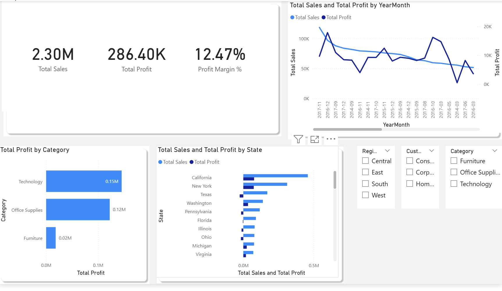
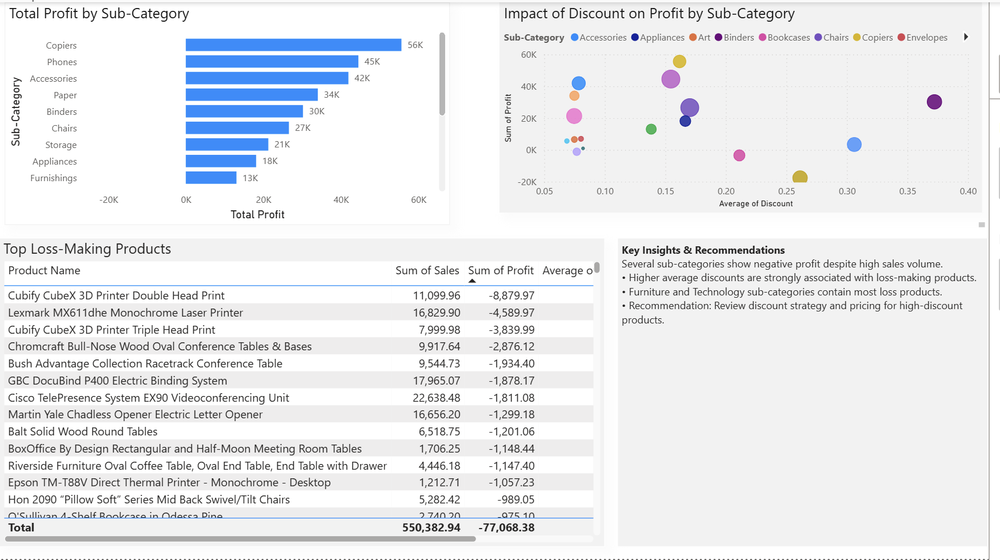

# 📊 Power BI Sales & Profit Analysis Dashboard

This project is an interactive Power BI dashboard designed to analyze
sales performance, profitability, and the impact of discounts across
products, categories, and regions.

## 🔍 Key Questions Answered
- How are sales and profit trending over time?
- Which categories and sub-categories are most profitable?
- Which states generate high sales but low profit?
- How do discounts impact profitability?
- Which products consistently generate losses?

## 🛠 Tools & Technologies
- Power BI Desktop
- DAX (Total Sales, Total Profit, Profit Margin %)
- Data modeling & relationships
- Conditional formatting
- Interactive slicers

## 📈 Dashboard Pages
### Page 1 – Sales Overview

### Page 2 – Product & Discount Insights

## 📌 Dataset
Sample retail (Superstore-style) dataset used for learning and portfolio purposes.

## 🚀 Author
**Ram Lal**  
Aspiring Data Analyst | Power BI | SQL | Analytics

